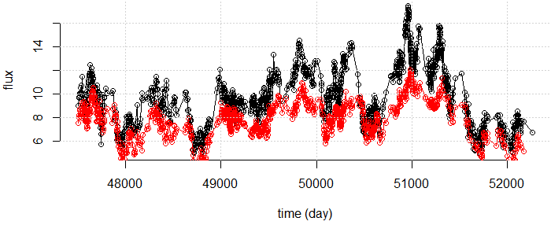
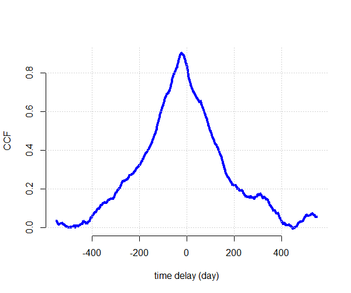
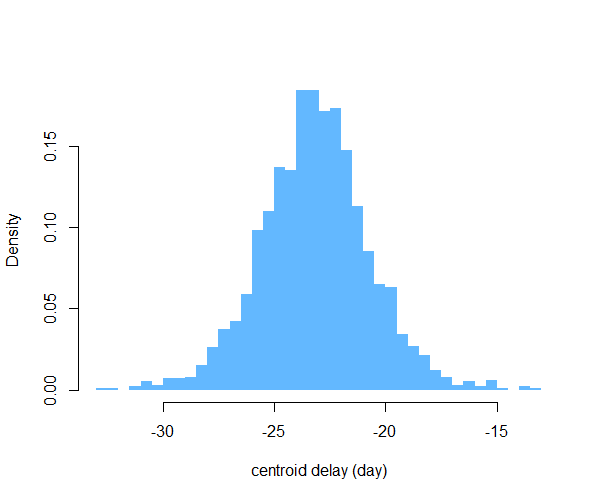

# Sour
Functions for cross correlation of unevenly sampled time series.

Sour is an R package for estimating the cross-correlation between
two time series which may be irregularly and/or non-simultaneously sampled. It
is [also a cocktail](https://en.wikipedia.org/wiki/Whiskey_sour): 


## Method

The CCF is computed using one of two methods:
* interpolated Cross Correlation Function (ICCF; Gaskell & Sparke 1986). 
* the Discrete Correlation Function (DCF; Edelson & Krolik 1988)

You can also produce estimates of uncertainty on the CCF, its peak and centroid
using the Flux Randomisation and Random Subsample Selection (FR/RSS) method of
Peterson et al. (1998).

## Setting up

Sour is an R package, but is still in development. To set up from GitHub first install (if you haven't already) Hadley Wickham's fantastic [devtools package](http://r-pkgs.had.co.nz/).
```R
   install.packages("devtools")
```
Now you can install sour straight from GitHub:
```R
   devtools::install_github("svdataman/sour")
```
and you're good to go.

## Example data

The package comes with an example dataset. The data comprise two time series cont and hbeta. Each series is an array or data frame with columns t, y (and optionally) dy. 
```R
  plot(cont$t, cont$y, bty = "n", type = "o", xlab = "time (day)", ylab = "flux")
  lines(hbeta$t, hbeta$y, type = "o", col = "red")
  grid()
```



The data show measurements of the optical continuum and H-beta line flux for the
active galaxy NGC 5548, obtained by [AGN
Watch](http://www.astronomy.ohio-state.edu/~agnwatch/n5548/lcv/). 

We can compute the CCF, using the ICCF method, as follows:

```R
  result <- sour::cross_correlate(cont, hbeta, dtau = 1, max.lag = 550)
  plot(result$tau, result$ccf, type = "l", bty = "n", xlab = "time delay", ylab = "CCF")
  grid()
```



The CCF peak at around -20 days indicates the Hbeta lags behind the continuum.

We can choose to use simulations to assess the centroid of the CCF near its peak.

```R
  result <- sour::cross_correlate(cont, hbeta, method = "iccf", local.est = TRUE, dtau = 1, nsim = 2000, max.lag = 120)
  hist(result$cent.dist, breaks = 50, col = "steelblue1", main = "", border = NA, prob = TRUE, xlab = "centroid delay (day)")
```

Here, the time is in units of days. We choose the width for the lag bins (dtau =
1.0), the maximum lag to examine (max.lag = 120.0), and the number of
simulations to use (nsim = 2000) when estimating the centroid distribution.
Setting local.est = TRUE means that the mean and variances are computed using
only pairs of data contributing to a given lag bin.



We can use these simulations to place intervals on the lag. Here we show the quartiles for the CCF centroid.

```R
   quantile(result$cent.dist)
       0%       25%       50%       75%      100% 
-32.73585 -24.75513 -23.28236 -21.79922 -13.49574 
```

## To do:
 * Bring interpolation outside of main loop (in iccf_core) for speed
 * understand why max|DCF| > 1 occurs 
 * proper unit tests

## References

For more info on the methods see:

* [R. Edelson & J. Krolik (1988; ApJ, v333, pp646-659)](http://adsabs.harvard.edu/abs/1988ApJ...333..646E)

* [C. M. Gaskell & L. S. Sparke (1986; ApJ, v305, pp175-186)](http://adsabs.harvard.edu/abs/1986ApJ...305..175G)

* [B. Peterson et al. (1998; PASJ, v110, pp660-670)](http://adsabs.harvard.edu/abs/1998PASP..110..660P)

## Referencing sour

If you make use of this code in your work, please do cite the following paper,
which first used the package, and for which sour was originally developed.

R. Edelson, J. Gelbord, E. Cackett, et al. (2017, ApJ, in press)