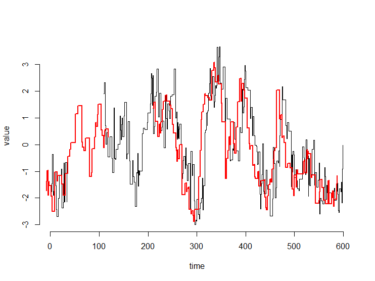
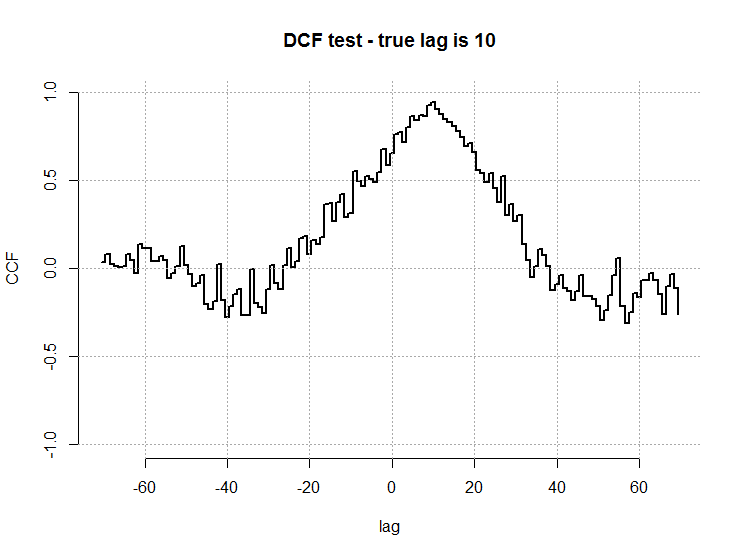
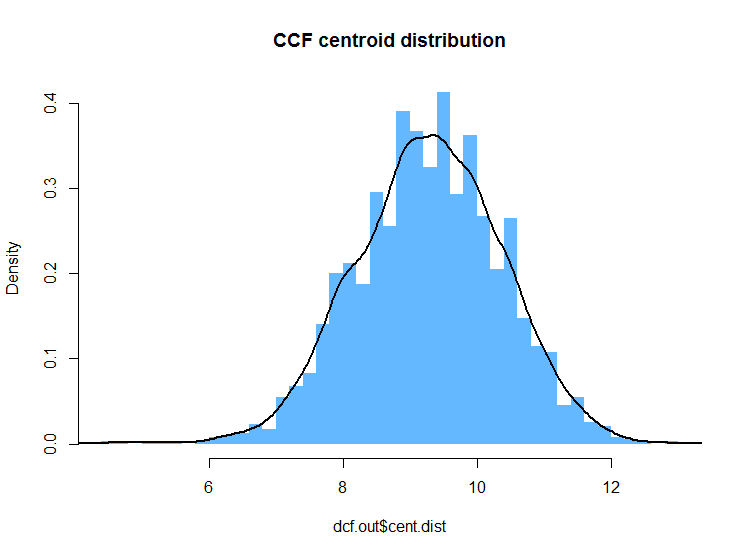

# CrossCorrelate
Functions for cross correlation of unevenly sampled time series.

These are pure R functions for estimating cross correlation functions (CCF) based to two time series that may be unevenly and asynchronously sampled time series. Options are the Discrete Correlation Function (DCF; Edelson & Krolik 1988) or the Interpolated Cross Correlation Function (ICCF; Gaskell & Sparke 1986). 
You can also produce estimates of uncertainty on the CCF, its peak and centroid using the Flux Randomisation and Random Subsample Selection (FR/RSS) method of Peterson et al. (1998). 

For a worked example: see the tests/test_CrossCorrelation.R script

Example of two time series to compare.

The resulting CCF computed with the DCF

The distribution of centroids of the CCF from 2,000 simulations.

For more info on the methods see:
R. Edelson & J. Krolik (1988; ApJ) http://adsabs.harvard.edu/abs/1988ApJ...333..646E
C. M. Gaskell & L. S. Sparke (1986; ApJ) http://adsabs.harvard.edu/abs/1986ApJ...305..175G
B. Peterson et al. (1998; PASJ) http://adsabs.harvard.edu/abs/1998PASP..110..660P
