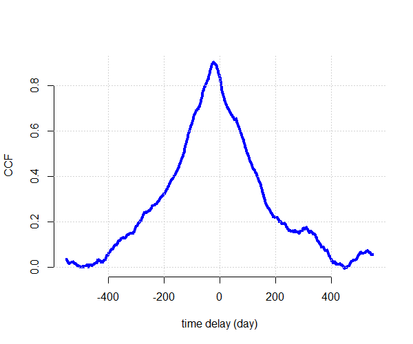
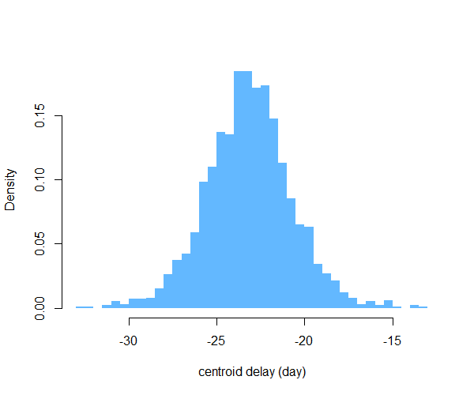

# Sour
Functions for cross correlation of unevenly sampled time series.

Sour is an R package for estimating the cross-correlation between
two time series which may be irregularly and/or non-simultaneously sampled. The
CCF is computed using one of two methods: (1) the Discrete Correlation Function
(DCF; Edelson & Krolik 1988) or (2) the Interpolated Cross Correlation Function
(ICCF; Gaskell & Sparke 1986). You can also produce estimates of uncertainty on
the CCF, its peak and centroid using the Flux Randomisation and Random Subsample
Selection (FR/RSS) method of Peterson et al. (1998).

## Setting up

Sour is an R package, but is still in development. To set up from GitHub first install (if you haven't already) Hadley Wickham's devtools package.
```R
   install.packages("devtools")
```
Now you can install tonic straight from GitHub:
```R
   devtools::install_github("svdataman/sour")
```
Now, load into your R session with
```R
   require(sour)
```
and you're good to go.

## Example

The package comes with an example dataset. The data comprise two time series cont and hbeta. Each series is an array or data frame with columns t, y (and optionally) dy. 

```R
  result <- cross.correlate(cont, hbeta, method = "iccf", 
                            dtau = 1, max.lag = 550)
  plot(result$tau, result$ccf, type = "l", bty = "n", 
       xlab = "time delay", ylab = "CCF")
  grid()
```



The data show measurements of the optical continuum and H-beta line flux for the
active galaxy NGC 5548, obtained by [AGN
Watch](http://www.astronomy.ohio-state.edu/~agnwatch/n5548/lcv/). The CCF peak
at around -20 days indicates the Hbeta lags behind the continuum.

Then we (optionally) use simulations to assess the centroid of the CCF near 
its peak.

```R
  result <- cross.correlate(cont, hbeta, method = "iccf", 
                             local.est = TRUE, 
                             dtau = 1, nsim = 2000, max.lag = 120)
  hist(result$cent.dist, breaks = 50, col = "steelblue1", main = "",
        border = NA, prob = TRUE, xlab = "centroid delay (day)")
```

Here we chose the width for the lag bins (1.0), the maximum lag to examine
(-120.0 to +120.0), and use 2,000 simulations to estimate the centroid
distribution. Setting local.est = TRUE means that the mean and variances are
computed using only pairs of data contributing to a given lag bin.



## References

For more info on the methods see:

[R. Edelson & J. Krolik (1988; ApJ)](http://adsabs.harvard.edu/abs/1988ApJ...333..646E)

[C. M. Gaskell & L. S. Sparke (1986; ApJ)](http://adsabs.harvard.edu/abs/1986ApJ...305..175G)

[B. Peterson et al. (1998; PASJ)](http://adsabs.harvard.edu/abs/1998PASP..110..660P)

